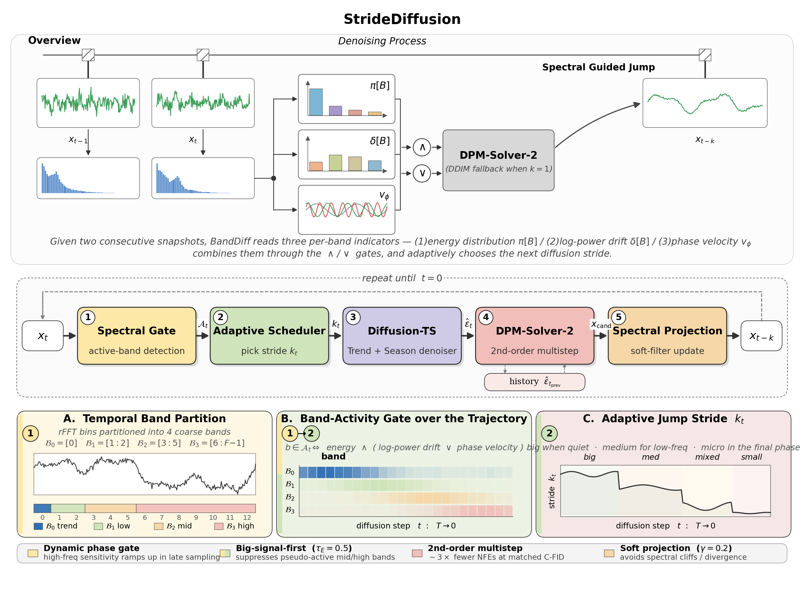

# StrideDiff: Frequency-Aware Variable-Stride Sampling for Time-Series Diffusion


StrideDiff accelerates diffusion-based time-series generation by replacing the
fixed per-step DDPM update with a **frequency-aware variable-stride scheduler**.
At each timestep we read a band-activity signal off the rFFT of the current
sample (energy, magnitude drift `|Δ log P|`, phase velocity), gate it with three
thresholds (`tau_energy`, `tau_dlogP`, `tau_pv`), and dynamically pick the jump
size:

* `big_k` — coarse stride when no bands are active,
* `med_k` — medium stride when only low bands are active,
* `small_k` — small stride when high bands are active or during the
  `last_k_always_micro` final timesteps.

The scheduler drops in on top of the Diffusion-TS interpretable transformer +
seasonal/trend decomposition backbone (see acknowledgements), so the same
checkpoint can be reused across the DDPM / DDIM / banded sampling paths.

<p align="center">
  
</p>

---

## Repository layout

```
stridediff/
├── main.py                          # train / unconditional / conditional entry point
├── Config/                          # per-dataset YAML configs (sines, stocks, etth, mujoco, energy, fmri)
├── Data/
│   ├── build_dataloader.py
│   └── datasets/                    # drop the dataset.zip contents here
├── Models/
│   ├── interpretable_diffusion/     # Diffusion-TS backbone + StrideDiff sampler
│   │   ├── gaussian_diffusion.py    #   sample(...) / sample_infill_banded(...)
│   │   ├── transformer.py
│   │   └── model_utils.py
│   └── ts2vec/                      # representation network for context-FID
├── Utils/                           # context-FID, predictive, discriminative, cross-corr metrics + dataset utils
├── engine/
│   ├── solver.py                    # Trainer (EMA + Adam + cosine schedule)
│   ├── lr_sch.py
│   └── logger.py
├── Experiments/
│   ├── run_cond_pipeline.py         # end-to-end conditional driver (train + sample + metric)
│   ├── compute_cond_metrics.py      # MSE on missing cells
│   ├── build_cond_report.py         # aggregate seeds → Markdown / LaTeX table
│   ├── hparam_search.py             # band-stride grid search
│   └── PIPELINE_COND_README.md      # detailed conditional-pipeline notes (中文)
├── figures/                         # framework + paper figures
├── Tutorial_*.ipynb                 # original Diffusion-TS walkthroughs (kept for reference)
├── requirements.txt
├── LICENSE
└── README.md
```

---

## Setup

```bash
conda create -n stridediff python=3.9 -y
conda activate stridediff
pip install -r requirements.txt
```

Tested with PyTorch 2.0.1 + CUDA on a single GPU. `dm-control` / `mujoco` are
only needed for the MuJoCo synthetic dataset.

### Dataset preparation

Stocks, ETTh1, Energy and fMRI can be downloaded from the
[Diffusion-TS Google Drive bundle](https://drive.google.com/file/d/11DI22zKWtHjXMnNGPWNUbyGz-JiEtZy6/view?usp=sharing).
Unzip `dataset.zip` and copy the contents to `Data/datasets/` (see
`Data/Place the dataset here`). Sines and MuJoCo are generated on-the-fly by
the dataloader.

---

## 1) Training

`main.py` trains until the `milestone`-th checkpoint (`save_cycle * milestone`
optimisation steps). Checkpoints land in `solver.results_folder` from the
config. One job per dataset on the chosen GPU:

```bash
nohup python -u main.py --gpu 4 --name etth   --config_file ./Config/etth.yaml   --sample 0 --milestone 10 --train > train_etth_mile10.log   2>&1 &
nohup python -u main.py --gpu 4 --name stocks --config_file ./Config/stocks.yaml --sample 0 --milestone 10 --train > train_stocks_mile10.log 2>&1 &
nohup python -u main.py --gpu 5 --name mujoco --config_file ./Config/mujoco.yaml --sample 0 --milestone 10 --train > train_mujoco_mile10.log 2>&1 &
nohup python -u main.py --gpu 5 --name energy --config_file ./Config/energy.yaml --sample 0 --milestone 10 --train > train_energy_mile10.log 2>&1 &
nohup python -u main.py --gpu 4 --name sines  --config_file ./Config/sines.yaml  --sample 0 --milestone 10 --train > train_sines_mile10.log  2>&1 &
nohup python -u main.py --gpu 3 --name fmri   --config_file ./Config/fmri.yaml   --sample 0 --milestone 10 --train > train_fmri_mile10.log   2>&1 &
```

---

## 2) Unconditional generation (StrideDiff sampler)

Inference and metrics are fused: the same call generates samples with the
band-stride scheduler and prints Context-FID / Discriminative / Predictive /
Cross-correlation scores. `--no_save_npy` keeps the disk clean during
hyper-parameter sweeps.

The per-dataset stride / threshold schedule that produced the reported numbers
is below — pass them as flags or read them off
`Experiments/run_cond_pipeline.py:BAND_HPARAMS`.

| Dataset | `big_k` | `med_k` | `small_k` | `last_k_always_micro` | `tau_energy` | `tau_dlogP` | `tau_pv` |
|---------|---------|---------|-----------|-----------------------|--------------|-------------|----------|
| sines   | 50      | 20      | 1         | 20                    | 0.1          | 0.01        | 0.04     |
| stocks  | 50      | 10      | 1         | 20                    | 0.1          | 0.01        | 0.04     |
| etth    | 50      | 10      | 1         | 12                    | 0.7          | 0.02        | 0.08     |
| mujoco  | 20      | 5       | 1         | 20                    | 0.5          | 0.02        | 0.04     |
| energy  | 40      | 5       | 1         | 12                    | 0.1          | 0.01        | 0.06     |
| fmri    | 20      | 5       | 1         | 20                    | 0.5          | 0.01        | 0.06     |

Example invocations (the exact commands behind the `inference_time_*_best.log`
files we ship):

```bash
python -u main.py --name sines  --config_file ./Config/sines.yaml  --milestone 10 --gpu 7 --sample 0 \
  --big_k 50 --med_k 20 --small_k 1 --last_k_always_micro 20 \
  --tau_energy 0.1 --tau_dlogP 0.01 --tau_pv 0.04 --no_save_npy

python -u main.py --name stock  --config_file ./Config/stocks.yaml --milestone 10 --gpu 7 --sample 0 \
  --big_k 50 --med_k 10 --small_k 1 --last_k_always_micro 20 \
  --tau_energy 0.1 --tau_dlogP 0.01 --tau_pv 0.04 --no_save_npy

python -u main.py --name etth   --config_file ./Config/etth.yaml   --milestone 10 --gpu 7 --sample 0 \
  --big_k 50 --med_k 10 --small_k 1 --last_k_always_micro 12 \
  --tau_energy 0.7 --tau_dlogP 0.02 --tau_pv 0.08 --no_save_npy

python -u main.py --name mujoco --config_file ./Config/mujoco.yaml --milestone 10 --gpu 1 --sample 0 \
  --big_k 20 --med_k 5  --small_k 1 --last_k_always_micro 20 \
  --tau_energy 0.5 --tau_dlogP 0.02 --tau_pv 0.04 --no_save_npy

python -u main.py --name energy --config_file ./Config/energy.yaml --milestone 10 --gpu 1 --sample 0 \
  --big_k 40 --med_k 5  --small_k 1 --last_k_always_micro 12 \
  --tau_energy 0.1 --tau_dlogP 0.01 --tau_pv 0.06 --no_save_npy

python -u main.py --name fmri   --config_file ./Config/fmri.yaml   --milestone 10 --gpu 1 --sample 0 \
  --big_k 20 --med_k 5  --small_k 1 --last_k_always_micro 20 \
  --tau_energy 0.5 --tau_dlogP 0.01 --tau_pv 0.06 --no_save_npy
```

To compute scores in the same call, append any subset of:

```
--eval_cfid --eval_corr --eval_disc --eval_pred --eval_iterations 5 --eval_repeats 3
```

(Discriminative / predictive scores require TensorFlow.)

---

## 3) Conditional generation (imputation & forecasting)

`Experiments/run_cond_pipeline.py` drives the full
**train → sample (× tasks × modes) → metric** loop on
Stocks / ETTh / Energy / fMRI, in parallel across the GPUs you list.
Three sampling paths are dispatched per task:

* `ddpm`    — full-T DDPM (`sample_infill`),
* `fast200` — 200-step DDIM (`fast_sample_infill`),
* `banded`  — StrideDiff frequency-aware variable-stride sampler
  (`sample_infill_banded`); per-dataset hparams come from `BAND_HPARAMS`.

Default window length is **48** (matching the conditional table in the paper).
Outputs land in
`OUTPUT/<dataset>_seed<s>_L48/cond/<task_tag>/{real,mask,fake_<mode>,time_<mode>,metric_<mode>}.{npy,json}`.

All conditional examples below run on **Stocks**; drop `--datasets stocks` (or
swap it for `etth` / `energy` / `fmri`) to extend the same command to other
datasets.

Quick start (Stocks, single GPU):

```bash
python Experiments/run_cond_pipeline.py --gpus 0 --datasets stocks
```

Forecasting subset, single seed (Stocks, 4 prediction lengths):

```bash
nohup python Experiments/run_cond_pipeline.py \
  --datasets stocks \
  --seeds 2027 \
  --gpus 0 \
  --modes banded \
  --tasks predict:6,predict:12,predict:24,predict:36 \
  --steps sample,metric \
  --no_skip_existing \
  > logs_cond_forecast_stocks_banded_withlang.out 2>&1 &
```

Imputation subset, single seed (Stocks, 5 missing-ratios from the Diffusion-TS paper):

```bash
nohup python Experiments/run_cond_pipeline.py \
  --datasets stocks \
  --seeds 2027 \
  --gpus 0 \
  --modes banded \
  --tasks infill:0.1,infill:0.25,infill:0.5,infill:0.75,infill:0.9 \
  --steps sample,metric \
  --no_skip_existing \
  > logs_cond_impute_stocks_banded_withlang.out 2>&1 &
```

After the runs finish, collect the seed(s) into Markdown + LaTeX tables (still
restricted to Stocks):

```bash
# Imputation
python Experiments/build_cond_report.py \
  --datasets stocks --seeds 2027 \
  --tasks infill:0.1,infill:0.25,infill:0.5,infill:0.75,infill:0.9 \
  --md_out  Experiments/cond_report_impute.md \
  --tex_out Experiments/cond_report_impute.tex

# Forecasting
python Experiments/build_cond_report.py \
  --datasets stocks --seeds 2027 \
  --tasks predict:6,predict:12,predict:24,predict:36 \
  --md_out  Experiments/cond_report_forecast.md \
  --tex_out Experiments/cond_report_forecast.tex
```

For more details (debug runs, reusing unconditional checkpoints, single-job
invocations), see `Experiments/PIPELINE_COND_README.md`.

---

## Acknowledgements

StrideDiff builds on the
[Diffusion-TS](https://openreview.net/forum?id=4h1apFjO99) backbone and reuses
its dataset preparation, evaluation harness and tutorials. The conditional
sampling paths inherit Diffusion-TS's `langevin_fn` observed-entry correction.
We also draw on:

* https://github.com/lucidrains/denoising-diffusion-pytorch
* https://github.com/Y-debug-sys/Diffusion-TS
* https://github.com/yuezhihan/ts2vec
* https://github.com/jsyoon0823/TimeGAN
* https://github.com/ermongroup/CSDI

## License

MIT — see `LICENSE`.
